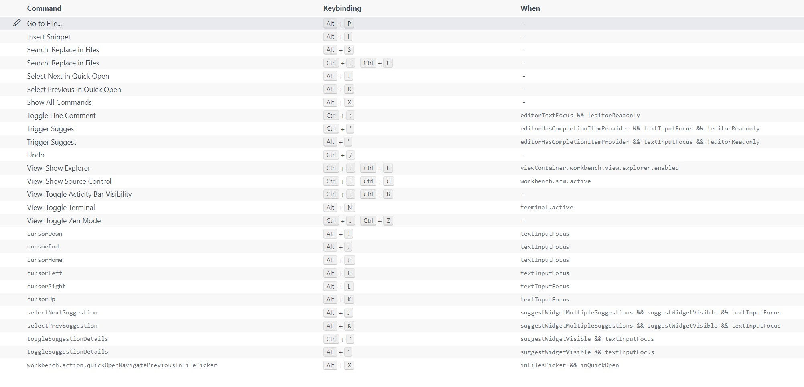

```
I have a vim, I have a emacs.
Eh~ vim-emacs!
I have a code, I have a vim-emacs.
Eh~ code-vim-emacs!
CVE!
```

What's `CVE` ?  Code-Vim-Emacs ! 😏 

Yep, it's just a simple and hybrid keymap. Just Enjoy it. 🌟

### Keyboard Shortcuts

Here is a intial keybindings screenshot:



### Howto

todo...

